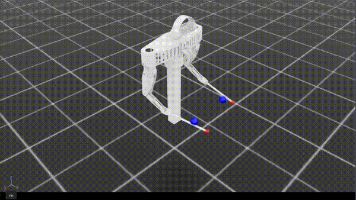

# Point Reaching

> **한 줄 요약**: 양팔 9-DOF 로봇의 양손 스틱 끝(팁)이 임의로 주어진 3D 목표 점 두 개로 수렴하도록 학습시킨 첫 번째 실험.
>
> **Status**: 부분 성공 (체크포인트 800K steps)
>
> **시기**: 2026-02

---

## 1. 동기 (Why)

Isaac Lab + skrl(PPO) 위에서 **9-DOF 양팔 로봇이 강화학습으로 의미 있는 공간 제어 동작을 학습할 수 있는지** 가장 단순한 형태로 검증하기 위한 실험.

드럼 연주라는 최종 목표는 여러 요소가 결합되어 있다.

- 양팔의 공간 좌표 제어
- 정확한 타격 동작 (스윙 운동 + 접촉 속도)
- 악보 타이밍에 맞춘 시간적 조율
- 목표 악기에 대한 손 배정

이 모두를 처음부터 동시에 학습시키려 하면 보상 설계와 디버깅이 어려워지므로, **가장 단순한 요소인 "공간 좌표 도달"만** 분리하여 학습 가능성을 확인하는 워밍업 실험으로 설계했다.

---

## 2. 문제 정의 (What)

- **목표**: 임의로 샘플링된 3D 점 두 개(왼손/오른손 각각)에 양손 스틱 끝이 수렴
- **성공 기준**: 양손 모두 목표 점에서 0.1m 이내에 10 스텝 연속 유지
- **실패 기준**: 관절각이 제한 범위 초과

---

## 3. 설계 (How)

### 관측 공간 (30차원)

| 항목 | 차원 |
|---|---|
| 관절 위치 | 9 |
| 관절 속도 | 9 |
| 목표 위치 (양손) | 6 |
| 위치 오차 (팁 - 목표) | 6 |

"현재 상태 + 목표 상태 + 오차"를 모두 관측에 포함. 특히 절대 위치만이 아닌 **오차를 명시적으로 넣은 것**이 학습 효율에 도움이 되는 것으로 보인다.

### 행동 공간

9차원 연속 행동. 각 관절에 작은 위치 증분 명령. (`action_scale = 0.03` 안정성 우선으로 한 step당 변화량을 작게 잡음.)

### 보상 설계

총 7개 항. 의도별로 묶어보면:

**위치 수렴 (dense)**
- 거리 항: 양손과 각 목표 점 사이 거리 합에 비례하는 음의 보상. 멀리서도 방향성 있는 신호를 주는 linear shaping
- 지수 항: 거리 합에 대해 `exp(-k · dist_sum)` 형태의 양의 보상. 목표에 가까워질수록 가파르게 증가해 정밀 수렴 유도

**관절 제한 (단계화)**
- 안전 마진 페널티: 관절이 하드 리미트에 도달하기 전, 안쪽 10° 마진 안으로 진입하면 진입 깊이에 비례한 제곱 페널티. 미리 제동을 거는 soft barrier
- 종료 페널티: 관절이 실제 하드 리미트를 넘어선 순간 큰 음의 보상 + episode 종료.

**정규화**
- action L2 페널티: 행동 벡터의 L2 노름. 불필요하게 큰 제어 입력을 억제해 동작을 매끄럽게
- 관절 속도 L2 페널티: 격렬한 움직임을 줄여 안정적 자세 유지

**성공 (sparse)**
- 성공 보너스: 양손이 모두 목표 점 0.1m 이내에 10 스텝 연속 유지된 순간 1회 부여. 스쳐 지나가는 것이 아니라 머무는 동작을 보상

설계 의도의 두 축:
- **linear + 지수의 두 층 구조**로 "멀리서의 방향 신호"와 "근처에서의 정밀도"를 동시에 챙김
- **안전 마진 페널티 + 종료 페널티**의 조합으로 관절 제한을 soft 영역(미리 경고) → hard 영역(에피소드 종료)으로 단계화

### 초기 자세 범위와 관절 제한의 분리

리셋 시 초기 자세를 샘플링하는 범위와, 학습 중 허용되는 관절 범위를 분리한다.

- **초기 자세 범위**: 좁은 안전 영역. 예: 허리 관절은 ±30°
- **학습 중 허용 범위**: 실제 하드웨어 한계까지의 넓은 영역. 예: 허리 관절은 ±90°

초기에 안전한 영역에서 시작해서 점차 탐색 범위를 넓혀가도록 한 설계.

### 환경 설정

| 항목 | 값 | 비고 |
|---|---|---|
| 병렬 환경 | 4096 | |
| policy dt | 1/60s | sim_dt=1/120s, decimation=2 |
| 에피소드 길이 | 5s | 300 step |
| action_scale | 0.03 | 작게 잡아 안정성 우선 |
| 학습 step | 800K | |

---

## 4. 결과

체크포인트 800K step에서 측정한 핵심 지표:

| 지표 | 값 | 의미 |
|---|---|---|
| 왼손 → 목표 거리 | 0.090 m | 도달 정밀도 |
| 오른손 → 목표 거리 | 0.157 m | 도달 정밀도 (양손 편차 있음) |
| 성공률 | 3.1% | 0.1m 이내 10 step 연속 유지 |
| 관절 제한 종료율 | 0.1% | 안전 영역 학습 여부 |

**도달은 됐다.** 양손 모두 목표 점 근처에 수렴한다. 왼손이 9 cm, 오른손이 16 cm로 양손 편차가 있다.

**그러나 "머무름"은 안 됐다.** 성공률 3.1%는 매우 낮은 수치이고, 이는 정책이 목표 근처를 *스쳐 지나가는* 동작은 만들지만 0.1m 이내에 10 step 연속 유지하는 동작은 거의 만들지 못함을 의미한다.

**관절 제한은 안정적으로 학습됐다.** 종료율 0.1%는 soft barrier + hard limit의 단계화가 의도대로 작동했음을 보여준다. 정책이 페널티 영역을 자발적으로 회피하는 자세를 익혔다.

영상으로 보면 양손이 목표 근처에서 진동하며 머무는 듯한 동작이다. **공간 도달 자체는 학습됐지만, "정지하여 유지"는 다음 과제로 남았다.**

---

## 5. 무엇이 잘 됐는가

- **Isaac Lab + skrl(PPO) 학습 파이프라인이 동작함을 확인**
- **9-DOF 양팔의 동시 제어가 RL로 수렴 가능**함을 확인.
- **`exp(-k·dist)` shaping의 효과**: 멀리서는 약한 linear 신호로 방향을 잡고, 가까워지면 exp 신호로 정밀하게 수렴한다.
- **soft barrier + hard limit 조합**: 관절 제한을 부드럽게 학습시킬 수 있음 (margin 안에서는 패널티, 넘으면 종료).

---

## 6. 한계와 막힌 점

- **시작하자마자 발산하는 방향으로 학습됨**. 보상이 음수이고 성공을 경험하지 못하면 에피소드를 빠르게 끝내는 것이 유리해진다. 일반적인 상황에서 보상이 양수가 되도록 가중치를 조정.
- **성공 기준으로 거리 조건만 두면 목표에 머무르지 않고 스쳐 지나감**. 일정 거리 이내에서 일정 step 이상 머물러야 성공으로 인정하도록 수정.
- **성공하더라도 에피소드를 끝내지 않고 가까운 거리만 유지하는 행동이 나타남**. 성공해서 에피소드를 끝내는 것보다 거리 보상을 지속적으로 받는 것이 유리한 구조. 성공 보상 크기를 키우면 해결될 수 있으나, 현재 체크포인트에서는 해결되지 않은 상태.

---

## 7. 다음 단계로 넘어간 이유

양팔 9-DOF 공간 좌표 제어가 RL로 학습 가능함을 확인했다. 다음 자연스러운 확장은 임의 점이 아닌 실제 드럼 객체를 향한 타격 동작.

---

## 8. 회고 / 배운 점

- **관측에 오차를 명시적으로 포함하는 것의 효과**. "현재 상태 + 목표 상태 + 오차"를 모두 관측에 두면, 정책이 절대 위치보다 차이 자체를 신호로 학습하기 쉬워진다. 이후 task에서도 유지되는 패턴.
- **보상의 두 층 구조 (linear + 지수)**. 단일 보상 형태로는 "멀리서의 신호 강도"와 "근처에서의 정밀도"를 동시에 챙기기 어렵다. 두 항을 가중 합하는 패턴이 효과적이며, 이후 task에서 축별로 분리되어 발전한다.
- **초기 자세 범위와 관절 제한의 분리**. 초기 자세를 안전한 영역에서 시작시키는 것이 학습 안정성에 기여. 이후 task에서도 유사한 분리 구조를 유지.
- **soft barrier + hard limit의 단계화**. 관절 제한을 부드럽게 학습시키려면 페널티 영역을 미리 두고, 그것을 넘었을 때 episode 종료로 강하게 잡는 두 단계 구조가 유효. → 자가 충돌도 먼저 패널티를 줘서 회피하도록 학습하고 안정되면 hard limit.