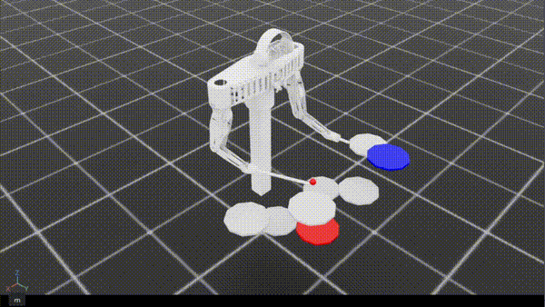

# Drum Striking

> **한 줄 요약**: 양팔 9-DOF 로봇이 8개의 드럼 중 양손에 각각 할당된 두 드럼을 타격하도록 학습시킨 실험.
>
> **Status**: 실패 (체크포인트 700K steps)
>
> **시기**: 2026-02 ~ 2026-03

---

## 1. 동기 (Why)

이전 단계에서 양팔 9-DOF가 임의의 3D 점에 수렴할 수 있음을 확인했다. 다음 자연스러운 단계는 **공간상의 한 점이 아닌 실제 드럼 객체**를 타격하는 것이다.

점 도달에서 드럼 타격으로 옮겨가면서 새로 다뤄야 할 요소가 세 가지였다:

- 타겟이 자유 좌표가 아닌 8개 고정 드럼 중 하나이며, 양팔에 서로 다른 드럼이 할당됨
- 단순한 위치 수렴이 아닌 "내려쳐서 튕겨 나오는" 동적 동작이 요구됨
- 정책이 양손 각각에 어느 드럼이 타겟인지를 인식할 수 있어야 함

이 실험의 목적은 위 세 요소를 한꺼번에 도입했을 때, 학습된 정책이 실제로 "타격다운 타격"을 만들어내는지 검증하는 것이다.

---

## 2. 문제 정의 (What)

- **드럼 8종**: 스네어, 플로어 톰, 미드 톰, 하이 톰, 하이햇, 라이드, 좌/우 크래시
- **양팔 조합**: 양손에 각가 목표 드럼이 할당되는 38가지 조합 중 episode마다 하나가 선택됨 (물리적으로 동싱 타격 가능한 조합)
- **타격의 정의**: 팁이 드럼과 일정 반경 안에서 충분한 하향 속도로 진입하면 "타격 준비" 상태로 잠기고, 그 상태에서 다시 충분한 상향 속도로 마진 안에 있으면 타격 성공으로 인정
- **에피소드 성공**: 양손이 각각 한 번씩 타격 성공
- **종료 조건**: 5초 타임아웃만 사용. 관절 제한을 넘어도 episode를 종료하지 않고 페널티만 부여

---

## 3. 설계 (How)

### 관측 공간 (50차원)

| 항목 | 차원 | 의도 |
|---|---|---|
| 관절 위치 | 9 | 현재 자세 |
| 관절 속도 | 9 | 현재 동작 방향 |
| 왼손 타겟 드럼 (one-hot) | 8 | 8개 드럼 중 어느 것이 왼손 타겟인가 |
| 오른손 타겟 드럼 (one-hot) | 8 | 8개 드럼 중 어느 것이 오른손 타겟인가 |
| 양손 팁과 타겟 드럼 사이의 위치 오차 | 6 | (오차 벡터) × 2 |
| 양손 팁의 속도 | 6 | 타격은 속도 의존적 동작이므로 정책에 직접 노출 |
| 양손의 타격 성공 플래그 | 2 | 이미 친 손인지 여부 |
| 양손의 타격 준비 상태 플래그 | 2 | 현재 내려치는 사이클에 진입했는지 여부 |

설계 의도 요약: 절대 좌표 대신 **타겟 one-hot + 오차 + 속도 + 사이클 상태**로 관측을 구성. 정책이 "어디로 가야 하는지"뿐 아니라 "지금 어느 단계에 있는지"까지 보도록 했다.

### 행동 공간

9차원 연속 행동, `action_scale = 0.03`.

### 보상 설계

총 9개 항. 의도별로 묶어보면:

**위치 수렴 (dense)**
- xy 평면 거리에 비례한 음의 보상 (양손 합)
- z 오차에 비례한 음의 보상 (양손 합)
- xy 거리에 대한 지수 보상 `exp(-k·dist)`, k=8
- z 오차에 대한 지수 보상 `exp(-k·err)`, k=10

xy와 z를 분리한 이유: 드럼 타격은 평면에서 정렬한 뒤 z 방향으로 내려치는 동작이라, 두 축의 의미가 다르다. 각각 독립적인 정밀도로 수렴하도록 보상도 분리.

**타격 모션 (마스킹 dense)**
- 하향 속도 보상: 드럼 xy 반경 + z 마진 안에서, 아직 타격 준비 상태가 아닐 때, 팁의 하향 속도에 비례
- 상향 속도 보상: 같은 영역에서, 타격 준비 상태일 때, 팁의 상향 속도에 비례

타격 준비 상태(`impact_armed`)는 1비트 플래그이다. 충분한 속도로 내려가면 켜지고, 충분한 속도로 튕겨 올라가거나 xy 영역을 벗어나면 풀린다. 이 비트의 켜짐/꺼짐에 따라 어느 속도 방향을 보상할지 분기.

**성공 (sparse)**
- 한 손이 처음 타격에 성공한 step에 +50

**정규화**
- action L2, 관절 속도 L2, 관절 제한 패널티

### 타격 판정의 두 단계

거리 조건만으로 타격을 판정하면 스쳐 지나가는 가짜 타격이 잡힌다. 그래서 타격 준비 상태를 도입했다:

1. xy 반경 안에서 하향 속도가 임계치를 넘으면 → 타격 준비 상태 켜짐
2. 타격 준비 상태에서 상향 속도가 임계치를 넘으면서 z 마진 안에 있으면 → 타격 성공, 동시에 준비 상태 해제

이 두 단계 구조 덕분에 "내려쳤다가 튕겨 나오는" 시퀀스를 거친 hit만 인정된다.

### 환경 설정

- 병렬 환경 128
- 에피소드 길이 5초
- 학습 step 700K

---

## 4. 결과



보상 그래프 첨부 예정

```
reward=0.593 | left_xy_dist=0.049 | right_xy_dist=0.040
left_z_err=0.045 | right_z_err=0.043
downward_term=0.164 | upward_term=0.045
action_l2=4.974 | joint_vel_l2=0.905 | limit_pen=0.000
impact_armed_L=0.135 | impact_armed_R=0.272
first_hit_L=0.000 | first_hit_R=0.000
```

이 메트릭이 결과를 그대로 말한다.

- **xy, z 모두 5cm 이내**: 도달 정밀도는 매우 높음. 양손 팁이 각자의 타겟 드럼 위에 정확히 위치한다.
- **타격 준비 상태에 일정 비율 진입**(13~27%): 내려치는 동작 자체는 일정 수준으로 발생함.
- **`first_hit`이 사실상 0**: 타격 준비 상태에 들어가긴 하지만 튕겨 나오는 상승 속도 조건을 거의 만들지 못함. 학습 700K 동안 인정된 타격이 거의 일어나지 않았다.
- **하향 속도(0.164)가 상향 속도(0.045)보다 큼**: 내려가긴 잘 하는데 튕기는 동작은 잘 못함.

영상으로 보면 양손이 드럼 위에 매우 정밀하게 도달해 머무는 — 즉 **"드럼 위에 수렴"** 정책에 가깝다. 타격이 아니다.

---

## 5. 무엇이 잘 됐는가

- **타겟 one-hot 관측**: 8개 드럼 × 38개 양팔 조합을 단일 정책이 처리할 수 있음을 확인. 절대 좌표를 빼고 one-hot으로 대체해도 학습이 됨.

---

## 6. 한계와 막힌 점

문제의 본질은 한 가지다: **위치 보상이 타격 보너스를 압도해서, 정책이 정적인 도달로 갇혔다.**

좀 더 분해하면:

- **위치 보상은 항상 활성화되고 항상 양수쪽으로 수렴 가능**. 타격을 하지 않아도 드럼 근처에 가만히 있으면 매 step 큰 보상을 받는다.
- **속도 보상은 좁은 영역(드럼 표면 근처)에서만 활성화**. 정책이 그 영역에 도달하기 전까지 학습 신호가 거의 없다.
- **`first_hit` 보너스는 매우 희귀함**: 한 episode에 최대 두 번 발생 가능한데, 그 두 번을 경험하기 위해서는 이미 타격 사이클을 만들어내야 한다. 한 번도 경험하지 못한 정책은 이 보상을 의식하지 못한다.
- 결과적으로 타격이 아닌 수렴 동작으로 학습이 수렴.

이 비대칭은 가중치 튜닝으로 풀리지 않는다. 본질은 가중치가 아니라 **보상의 구조**다. 도달 보상은 시간에 무관하게 항상 켜져 있고, 타격 동작은 특정 순간에만 발생해야 하는 시간 의존적 신호다. 두 신호가 같은 평면에 놓이는 한, 정책은 시간 무관한 안정점으로 수렴한다.

---

## 7. 다음 단계로 넘어간 이유

학습된 정책은 "타격 동작"이 아니라 "도달 후 정지 동작"이다. 더 길게 학습시켜도 보상 구조 자체가 도달을 선호하기 때문에 큰 개선은 어렵다고 판단했다.

다음 실험은 **보상을 "위치 + sparse 타격 보너스"가 아니라, 동작의 시간 구조 자체에 묶인 형태로 재설계한다.** 즉, "내려친다 → 친다 → 다시 들어올린다"는 사이클을 보상 함수가 직접 강제해야 한다.

---

## 8. 회고 / 배운 점

- **"성공 보상이 희귀한 경우** 학습이 성공을 배우지 못하고 차선을 택함. 성공하기 위해 중간 과정을 유도하는 보상 설계가 필요.
- **one-hot 타겟**으로 목표를 주는 건 효과적이다.