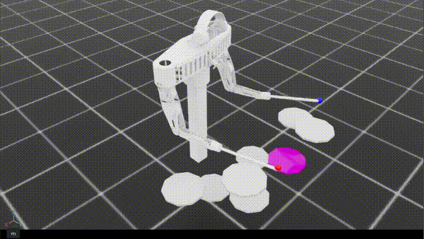
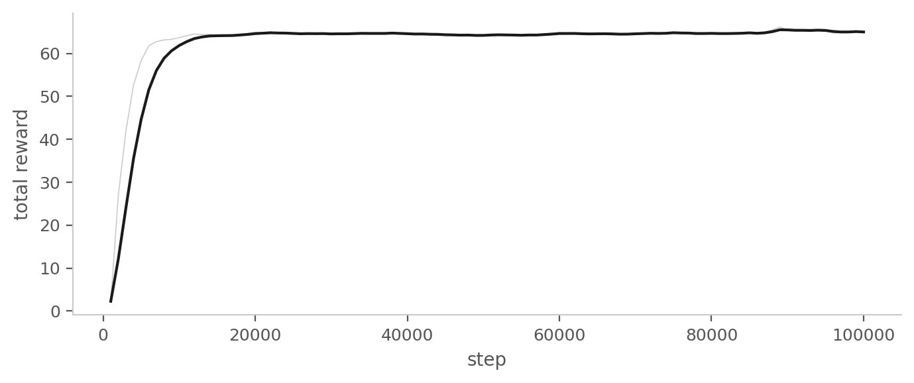

# Drum Striking

> **한 줄 요약**: 타격 동작을 IDLE → LIFT → DESCEND → RETURN의 4단계 사이클로 분해하고, 각 단계에서 적절한 움직임을 직접 보상함으로써 양팔 9-DOF 로봇에 실제 타격 모션을 학습시킨 실험.
>
> **Status**: 부분 성공 (체크포인트 100K steps)
>
> **시기**: 2026-03

---

## 1. 동기 (Why)

이전 단계에서 정책이 드럼 위에 정밀하게 도달했지만 실제 타격 동작은 거의 일어나지 않았다. 원인은 보상 구조의 비대칭에 있었다 — 밀집된 위치 수렴 보상이 항상 활성화되어 있어, 도달 후 정지가 가장 보상이 큰 안정점이 되었기 때문이다.

이 문제를 풀려면 **보상 함수가 시간 의존적이어야 한다.** 정책에 "지금 어디로 가라"가 아니라 "지금 이 단계에 있으니 이런 동작을 해라"를 신호로 줘야 한다는 가설이다.

이 실험은 그 가설을 다음과 같이 구체화한다:

> 타격 동작 한 번을 IDLE → LIFT → DESCEND → RETURN의 4단계 phase로 모델링하고, 각 phase에 맞는 motion shaping을 보상에 명시한다. 정책은 현재 phase를 관측으로 보면서 단계별로 다른 행동을 학습한다.

---

## 2. 문제 정의 (What)

- **목표**: 양손이 각각 할당된 드럼에 대해 한 번의 완전한 타격 사이클을 완주
- **사이클의 정의**:
  - **IDLE**: 시작 상태. 손이 드럼 xy 범위에 들어가면 LIFT로 전이
  - **LIFT**: 드럼 위로 일정 높이까지 들어올림
  - **DESCEND**: 임팩트 속도로 z=0(드럼 표면)을 통과
  - **RETURN**: 다시 들어올려 드럼 위로 복귀
- **성공**: 양손이 모두 RETURN까지 완주
- **실패**: 각 phase에서 정의된 이탈 조건 충족 (xy 범위 이탈, 임팩트 속도 미달 등)

즉 단순한 "한 번의 타격"이 아니라 **타격 모션 전체 사이클의 완주**를 성공으로 본다.

---

## 3. 설계 (How)

### 관측 공간 (58차원)

| 항목 | 차원 | 의도 |
|---|---|---|
| 관절 위치 | 9 | 현재 자세 |
| 관절 속도 | 9 | 현재 동작 방향 |
| 왼손 타겟 드럼 (one-hot) | 8 | 8개 드럼 중 어느 것이 왼손 타겟인가 |
| 오른손 타겟 드럼 (one-hot) | 8 | 8개 드럼 중 어느 것이 오른손 타겟인가 |
| 양손 팁과 타겟 드럼 사이의 위치 오차 | 6 | (오차 벡터) × 2 |
| 양손 팁의 속도 | 6 | 팁 속도 |
| 양손의 현재 phase (one-hot) | 10 | 각 손의 현재 phase가 무엇인지 (IDLE/LIFT/DESCEND/RETURN + 여분 1) |
| 양손의 타격 성공 플래그 | 2 | 이미 친 손인지 여부 |

phase를 관측에 노출시킨 이유는 결정적이다. 후술할 보상이 phase에 따라 다른 motion을 요구하는데, 정책이 자신의 phase를 모르면 같은 상태에서 다른 행동을 해야 하는 모순에 빠진다. 보상이 phase 의존적이면 관측도 phase 의존적이어야 한다.

### 행동 공간

9차원 연속 행동, `action_scale = 0.03`.

### 핵심 아이디어: phase별 motion shaping

각 보상 항이 다음 구조를 가진다.

```
phase_term = phase_mask × motion_shape
```

여기서 `phase_mask`는 "현재 그 phase인가"를 0/1로, `motion_shape`은 해당 phase에서 좋은 움직임을 정의한다. **같은 변수(xy 거리, z 오차, 팁의 vz)가 phase에 따라 다른 기여를 만드는 게 핵심**이다.

| Phase | xy 항 | z 항 | velocity 항 |
|---|---|---|---|
| IDLE | 음의 xy 거리 (드럼으로 가까이) | — | — |
| LIFT | 음의 xy 거리 (정렬 유지) | z 들어올림 보상 | 상향 속도 보상 |
| DESCEND | `exp(-80·xy_dist)` (매우 정밀) | `exp(-120·z_err)` (매우 정밀) | 강한 하향 속도 보상 |
| RETURN | 음의 xy 거리 | 다시 들어올림 | 상향 속도 보상 |

DESCEND의 지수 shaping 계수가 매우 가파른 점이 중요하다 (k=80, 120). IDLE/LIFT 단계의 거리 보상은 부드러운 유도용이지만, DESCEND 단계는 **드럼 표면 바로 위 좁은 영역에서만 큰 보상**을 만든다. 정책이 임팩트 지점에 정확히 들어왔을 때만 보상이 솟구치도록 설계.

### 성공·실패 보상

- **첫 성공 보상**: 한 손이 처음으로 사이클을 완주한 step에 양의 보상
- **에피소드 성공 보상**: 양손이 모두 완주 상태인 동안 매 step 양의 보상
- **첫 실패 페널티**: 한 손이 처음 fail로 잠긴 step에 음의 보상
- **성공 후 정적 페널티**: 이미 성공한 손은 가만히 있도록 속도 L2 페널티

성공 보상을 두 군데(첫 성공 + 에피소드 성공)로 분산시킨 것은 학습 안정성을 위함. 단일 큰 보너스는 신호가 너무 희귀하다.

### Phase 전이 로직

상태 전이는 환경이 결정한다. 각 phase의 종료 조건이 환경 내부에 정의되어 있다:

- IDLE → LIFT: xy 거리가 일정 반경 이내
- LIFT → DESCEND: xy 거리 충분히 가깝고, 드럼 위 일정 높이 도달
- DESCEND → RETURN: xy 매우 가깝고, z 부호 전환(드럼 표면 통과), 하향 속도 ≥ 임계값
- RETURN → 성공: xy 정렬되고, 드럼 위 일정 높이 도달

각 phase에는 fail 반경도 함께 정의된다. xy가 너무 멀어지면 그 손은 fail로 잠긴다.

### 환경 설정

- 병렬 환경 128
- 에피소드 길이 5초
- 학습 step 100K

---

## 4. 결과





체크포인트 100K step에서 측정한 핵심 지표:

| 지표 | 왼손 | 오른손 | 의미 |
|---|---|---|---|
| 사이클 완주 성공률 | 96.4% | 98.6% | IDLE→LIFT→DESCEND→RETURN 완주 |
| Fail 잠금률 | 2.5% | 2.0% | phase 이탈 |
| 에피소드 성공률 | 95.9% | | 양손 모두 완주 |

phase별 보상 활성화:

| Phase | 평균 보상 |
|---|---|
| IDLE | −0.20 |
| LIFT | +0.40 |
| DESCEND | +0.61 |
| RETURN | +0.31 |

**가설이 검증됐다.** 사이클 완주 성공률 96% 이상, 에피소드 성공률 96%로, phase × motion shaping 구조가 02번의 정적 수렴 문제를 풀었다.

**phase 4단계가 모두 활성화됐다.** IDLE만 거리 기반 음의 보상이고, LIFT/DESCEND/RETURN 세 단계 모두 안정적인 양수다. 정책이 한 자세에 갇히지 않고 네 단계를 차례로 거치는 시퀀스를 학습했다는 직접적 증거다.

**100K step만에 수렴했다.** 02번이 700K step을 돌고도 타격을 만들지 못한 것과 대비된다.

영상으로도 들어올렸다가 내려치고 다시 복귀하는 실제 타격 모션이 나온다. **정적 수렴이 아닌, 시간 구조를 가진 동작이 학습됐다.**

---

## 5. 무엇이 잘 됐는가

- **가설 검증**: phase × motion shaping 구조로 보상을 재구성하면 정적 수렴 문제가 풀린다. 사이클 완주 정책이 빠르게 학습됨.
- **phase 관측의 효과**: 정책에 현재 phase를 알려주니 같은 위치에서도 phase에 따라 다른 행동이 가능. 관측과 보상이 같은 상태 변수를 공유.
- **단계별 학습 커리큘럼**. 초반에는 IDLE → LIFT 상태 전이가 잘 일어나도록 학습하다가 파라미터를 변경하여 LIFT → DESCEND 상태 전이가 잘 일어나도록 학습.
- **난이도별 학습 커리큘럼**. 초반에는 타격이나 상태 전이 조건을 낮게 설정해 성공 경험을 더 자주 하도록 유도하여 성공하는 방향으로 학습을 진행하다가 조건을 더 높여서 타격 동작의 질을 높임.

---

## 6. 한계와 막힌 점

- **Phase가 환경에 하드코딩됨**. IDLE/LIFT/DESCEND/RETURN의 경계 파라미터가 환경 측에 12개 이상 정의되어 있다. 새 task로 일반화하려면 이걸 매번 다시 설계해야 한다. 학습이 한 일은 phase 안에서의 motion 최적화에 한정되고, "사이클 자체를 발견하는" 학습은 일어나지 않는다.
- **하이퍼파라미터 폭증**. 보상 항이 단계별 motion 10개 + 성공 2개 + 실패 1개 + 정규화 4개로 17개. 가중치 튜닝 부담이 크다.

---

## 7. 다음 단계로 넘어간 이유

단발 타격 동작은 학습 가능함을 확인했다. 다음 자연스러운 확장은 **시간 축**이다. 드럼 연주는 단순히 "친다"가 아니라 "정해진 시점에 친다"이므로, 외부에서 주어진 악보를 따라 타이밍을 맞추는 정책이 필요하다.

---

## 8. 회고 / 배운 점

- **보상 = 행동 단계의 마스킹**이라는 패턴을 발견. phase 변수를 곱하면 같은 motion 변수가 단계마다 다른 의미로 작동한다. 도달이 아닌 동작을 학습시키는 데 매우 효과적인 구조.
- **phase는 보상뿐 아니라 관측에도 들어가야 한다**. 보상에만 phase 마스킹을 걸고 정책에 phase를 알려주지 않으면, 동일 입력에 다른 출력을 요구하게 되어 학습이 발산. 보상이 phase 의존적이면 관측도 phase 의존적이어야 한다 — 기본 원칙.
- **보상 설계만큼 중요한 것은 파라미터 튜닝 및 커리큘럼**. 파라미터 튜닝이나 커리큘럼 설계를 어떻게 하는지에 따라 학습 결과가 크게 차이난다.