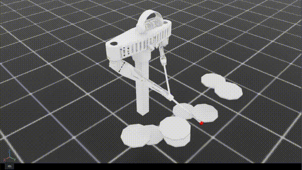

# Rhythmic Drum Striking

> **한 줄 요약**: 양팔 9-DOF 로봇의 양손 스틱 끝(팁)이 임의로 주어진 3D 목표 점 두 개로 수렴하도록 학습시킨 첫 번째 실험.
>
> **Status**: 실패 (체크포인트 1M steps)
>
> **시기**: 2026-03 ~ 2026-04

---

## 1. 동기 (Why)
왜 이 task를 만들었는가. 이전 단계에서 무엇이 부족했기에 이걸 시도했는가.

## 2. 문제 정의 (What)
- 목표: 구체적으로 무엇을 학습시키나
- 입력 (관측): 어떤 정보를 주는가
- 출력 (행동): 무엇을 결정하나
- 성공 기준: 무엇을 보고 "됐다"고 판단했나

## 3. 설계 (How)
- 관측 벡터 구성과 그 이유
- 행동 공간 구성과 그 이유
- 보상 함수 항목들과 각각의 의도
- 주요 하이퍼파라미터

## 4. 결과

- 정량적 결과 (성공률, 학습 곡선, 체크포인트 step 수)
- 정성적 결과 (영상이 있다면 링크, 또는 텍스트 설명)
reward=-0.265 | proximity_term=0.012 | progress=0.001 | action_l2=4.963 | joint_vel_l2=2.246 | limit_pen=0.008 | tip_limit=0.001 | success_rate=0.119 | wrong_rate=0.244 | miss_rate=0.637 | snare_success_rate=0.118 | floor_success_rate=0.166 | mid_success_rate=0.058 | high_success_rate=0.117 | hihat_success_rate=0.186 | ride_success_rate=0.107 | crash1_success_rate=0.056 | crash2_success_rate=0.040

## 5. 무엇이 잘 됐는가
- 의도한 대로 동작한 부분
- 예상보다 좋았던 부분

## 6. 한계와 막힌 점
- 어디서 막혔는가
- 왜 막혔다고 추정하는가
- 우회/해결 시도와 결과

## 7. 다음 단계로 넘어간 이유
- 이 실험으로 충분하지 않다고 판단한 근거
- 다음 task가 어떻게 이 한계를 해결하려 했는가

## 8. 회고 / 배운 점
- 이 실험에서 얻은 인사이트
- 다시 한다면 어떻게 다르게 할 것인가