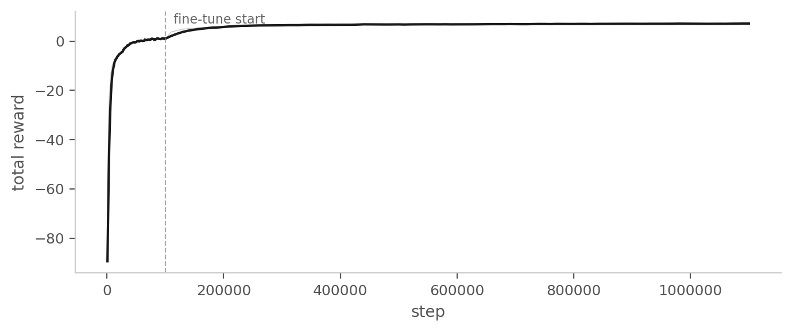

# Rhythmic Drum Striking

> **한 줄 요약**: 랜덤으로 생성된 악보에 맞춰 양팔 9-DOF 로봇이 정해진 타이밍에 목표 드럼을 타격하도록 학습시킨 실험.
>
> **Status**: 실패 (체크포인트 1M steps)
>
> **시기**: 2026-04 ~ 2026-05

---

## 1. 동기 (Why)

04번에서 두 문제가 함께 드러났다. 전체 성공률이 12.6%로 낮은 것, 그리고 드럼별 성공률 편차가 5배에 달해 멀리 있는 드럼은 거의 학습되지 않은 것.

후자의 원인은 학습에 사용한 RDS 자체에 있다. MIDI 파일에서 추출한 악보는 실제 음악적 분포를 따르므로 스네어와 그 주변 드럼이 압도적으로 자주 등장한다. Segment별 점수로 다양성이 큰 악보를 우선 sampling하는 보정을 넣었지만, 원본 분포의 편향까지 상쇄하기엔 부족했다.

따라서 다음 실험은 악보 분포를 바꾼다:

> MIDI에서 추출한 RDS 대신, 8개 드럼이 균등하게 등장하는 랜덤 RDS로 학습한다.

---

## 2. 문제 정의 (What)

- **악보(RDS)**: 5초 에피소드 동안의 시간 × 8드럼 0/1 텐서, 시간 길이는 300 step.
- **랜덤 생성 방식**: episode를 10개 시간 구간으로 균등 분할하여, 각 구간에서 (시점 1개, 드럼 1개)를 무작위로 선택. 즉 에피소드당 정확히 10개의 노트가 시간적으로 분산된다.
- **타격 성공 조건**: 노트 시점 ±10 step 안에 해당 드럼의 hit 발생
- **두 종류의 실패**: 놓침(윈도우 끝났는데 hit 없음), 잘못 침(어떤 윈도우에도 속하지 않는 hit)

**중요한 학습 절차**: 처음부터 랜덤 RDS로 학습하면 수렴하지 못한다는 것을 확인했다. 모든 드럼이 균등하게 등장하는 환경에서는 초기 정책이 도달해야 할 위치가 매 episode마다 크게 흩어져, 의미 있는 성공 경험을 만들지 못한다. 그래서 **MIDI 기반 실험의 100K step 체크포인트에서 시작**해서, 랜덤 RDS 환경으로 fine-tune. MIDI 단계에서 "주어진 타겟 위치 방향으로 이동"이라는 기본 운동 prior를 확보한 뒤, 그 위에서 균등 분포의 RDS를 학습하는 2단계 curriculum.

---

## 3. 설계 (How)

### 관측 공간 (304차원)

| 항목 | 차원 |
|---|---|
| 관절 위치, 관절 속도 | 18 |
| 양손 팁 위치 | 6 |
| 8개 드럼 위치 | 24 |
| 미래 30 step의 악보 one-hot (8 drum × 30) | 240 |
| **양손의 드럼별 타격 준비 상태 비트** | **16** |

마지막 항목이 새로 추가된 정보다. 양손이 8개 드럼 각각에 대해 "지금 칠 수 있는 상태(armed)인지 disarmed인지"를 정책이 직접 관측한다. 후술할 phase 보상이 이 상태에 따라 다르게 활성화되므로, 정책이 이 상태를 알아야 일관된 행동을 학습할 수 있다.

### 행동 공간

9차원 연속 행동. **행동의 의미는 관절 각속도 명령**이다. 정책 출력에 π를 곱하고 환경의 시간 간격(dt)으로 적분해 다음 관절 위치를 만든다. 한 step당 변화량은 위치 증분 방식과 비슷한 규모지만, 정책이 학습하는 표현은 "다음 자세"가 아니라 "지금 어느 방향으로 얼마나 빠르게"가 된다.

이 표현 변경의 의도는 실제 드럼 로봇 하드웨어가 보통 속도 명령으로 제어되기 때문에, sim-to-real 시점에서 표현 일관성을 갖기 위함.

### Phase 보상 도입

이 실험의 핵심이다. RDS의 다음 타겟 드럼에 대해 다음 두 항을 추가한다:

```
strike_phase = (다음 타겟 드럼) × (해당 손이 armed 상태) × (하향 속도)
rearm_phase  = (다음 타겟 드럼) × (해당 손이 disarmed 상태) × (상향 속도)
```

해석:
- 다음 노트의 드럼을 향해 **아직 안 친 상태**라면 → 내려치는 속도를 보상
- 같은 드럼에서 **이미 친 상태**라면 → 다시 올라가는 속도를 보상

이는 단발 타격 실험의 들어올림 → 임팩트 → 복귀 사이클을 RDS의 매 노트마다 반복하는 것과 같다. 환경이 명시적인 FSM 상태를 두진 않지만, 타격 준비 비트와 팁의 수직 속도 부호의 조합으로 동일한 의미의 motion shaping을 만든다.

### 근접 보상의 시간 감쇠

근접 비용에 **시간 감쇠를 곱한다**:

```
proximity = exp(-k × first_idx) × current_assignment_cost,  k=0.1
```

여기서 `first_idx`는 다음 타겟까지의 step 거리. 30 step 뒤의 노트는 `exp(-3) ≈ 0.05`로 거의 무시되고, 가까운 노트일수록 강하게 적용된다. 정책이 임박한 노트에 주의를 집중하도록 유도.

### 드럼 표면 통과 페널티

자유로운 보상 구조에서 정책이 드럼 표면을 뚫고 아래로 내려가는 비현실적 자세를 학습할 수 있다. 이를 막기 위해 **드럼 xy 범위 안에 있으면서 z가 표면보다 5cm 이상 낮으면 페널티**를 부여한다.

### Idle 자세에 허리 각도 추가

Idle 위치를 양손 팁의 3D 좌표만이 아니라 허리 관절의 idle 각도(10°)까지 포함한 4차원으로 정의한다. 양손 할당 비용 계산에서 허리 자세까지 idle에 가까운지를 비용에 반영. 정책이 default 자세를 유지하게 만들어, 양팔의 작업 공간이 일정한 기준 자세에서 정의되도록 유도.

### 파라미터 구성

가중치를 전반적으로 약하게 둔다:

- 잘못 침 페널티 가중치를 작게 — 탐색을 막지 않도록
- 진행/근접 가중치도 낮게 — 거리 기반 보상 비중 축소
- 안전 박스 페널티는 큰 boolean 형태가 아닌 작은 soft 신호로

타격 판정 조건은 완화한다:

- 드럼 범위 증가
- 타격 기준 속도 감소
- 준비 상태 기준 높이 감소

### 환경 설정

- 병렬 환경 128
- 에피소드 길이 5초
- 랜덤 RDS 노트 수: 10개 (시간 구간별 sampling)
- 학습 step 1M (단발 타격 단계의 100K 체크포인트에서 fine-tune 시작)

---

## 4. 결과

**학습된 정책 동작**


**학습 곡선 (total reward vs step)**



**측정 지표**

| 지표 | 값 |
|---|---|
| 성공률 | 17.9% |
| 잘못 침 비율 | 44.7% |
| 놓침 비율 | 37.4% |
| Strike phase 보상 | 0.359 |
| 진행 보상 (×100) | 0.347 |

**드럼별 편차가 좁혀졌다.** 04번에서 4% 미만이던 좌 크래시가 35% 수준까지 올라왔다. 균등 분포 RDS를 도입한 목적 — 어느 드럼도 학습에서 소외되지 않는 상태 — 가 달성됐다.

**전체 성공률은 04번과 단순 비교하기 어렵다.** 04번의 12.6%는 스네어 비중이 큰 분포에서의 수치이고, 05번의 17.9%는 8개 드럼이 균등하게 등장하는 분포에서의 수치다. 정책이 풀어야 할 악보의 성격이 달라졌고, 그 위에서 측정된 값이다.

**잘못 침이 절반에 가깝다.** 잘못 침 비율 44.7%는 정책의 hit 시도 중 거의 절반이 어떤 노트의 윈도우에도 속하지 않음을 의미한다. Strike phase 보상(0.359)과 진행 보상도 의미 있는 양으로 활성화돼 정책이 적극적으로 움직이고는 있지만, 그 적극성이 정확도로 이어지지 않았다. 04번에서 진행 보상이 0.001로 죽어 있던 것과 비교하면 dense 학습 신호 자체는 살아났다는 신호다.

영상으로 보면 양손이 움직임 자체는 적극적이지만 정확한 드럼에 닿지 못하는 경우가 잦다. **정책의 모드를 한마디로 정리하면 "일단 치자, 하지만 부정확함"이다.**

---

## 5. 무엇이 잘 됐는가

- **드럼별 편차 완화**: 균등 분포 RDS 도입의 직접 효과. 04번에서 학습되지 않았던 멀리 있는 드럼이 학습 분포에 들어옴.
- **2단계 curriculum의 효과 확인**: 처음부터 랜덤 RDS로는 수렴하지 못함. MIDI 100K로 기본 운동 prior를 확보한 후 균등 분포로 옮기니 학습이 안정됨.
- **Phase 보상의 재도입이 성과**: 환경이 명시적 FSM을 두지 않고도 1비트 플래그와 속도 부호만으로 motion shaping을 만들 수 있는 가벼운 방법이 유효함을 검증. 
- **속도 명령 표현의 채택**: sim-to-real 일관성 측면에서 의미 있는 결정. 학습 자체에 큰 부정적 영향 없이 동작.
- **타격 준비 비트의 관측 노출과 phase 보상의 페어링**: 관측과 보상이 같은 상태 변수를 공유하여 정책이 일관된 행동을 학습할 수 있는 구조 확보.
- **드럼 표면 통과 페널티와 idle 자세** 같은 작은 변화들이 정책의 비현실적 동작을 줄이는 데 기여.

---

## 6. 한계와 막힌 점

진전이 있었지만 **여전히 실용 수준이 아니다**.

- **드럼 사이 중간으로 수렴**. 근접 보상의 시간 감쇠를 곱하여 미래의 여러 목표를 동시에 고려하게 되면 다음 목표 드럼이 아닌 그 사이 중간 점으로 이동함. 가장 가까운 목표에 대한 할당 비용만 구하도록 수정.
- **성공률의 절대 수준**. 균등 분포 위에서 17.9%는 충분치 않음. 04번 대비 분포가 어려워진 영향을 고려하더라도, 실용 수준에는 한참 못 미친다.
- **잘못 침 비율이 너무 높음**. 탐색은 풀렸지만 "치자"로 옮긴 정책이 정확도를 갖지 못함. 노트 시도의 거의 절반이 엉뚱한 타격. 잘못 침 가중치가 약해서 정확성에 대한 압력 부족.
- **드럼별 편차의 비대칭**: 랜덤 RDS 분포를 사용했음에도 특정 드럼이 극단적으로 안 됨. 양손 역할 분담이 정책 안에 명시되어 있지 않아서, 어떤 드럼은 두 손 모두 가지 않거나 잘못된 손이 가는 듯한 양상.

---

## 7. 다음 단계로 넘어간 이유

성공률이 17.9%에 머물렀고, 잘못 침이 절반에 가까운 양상에서 **1M step을 더 돌렸을 때 가파른 개선은 예상하기 어려운 상태**였다.

---

## 8. 회고 / 배운 점

- **Curriculum의 위력**. 처음부터 랜덤 RDS면 수렴 못 함 → MIDI로 학습 → 랜덤 RDS fine-tune. 랜덤 악보는 성공을 못해서 수렴되지 않았는데 편향된 MIDI 분포로 학습하고 옮기면 학습이 안정됨.
- **잘못 침 페널티의 trade-off는 실재한다**. 가중치를 크게 두면 보수성이 강해져 탐색이 막히고, 작게 두면 정확도가 떨어진다. 한 가중치가 정책의 모드를 통째로 바꿀 수 있다는 사실의 직접 체감.
- **관측과 보상은 같은 상태 변수를 공유해야 한다**. 타격 준비 비트를 보상에 썼다면 관측에도 줘야 정책이 일관된 행동을 학습한다.