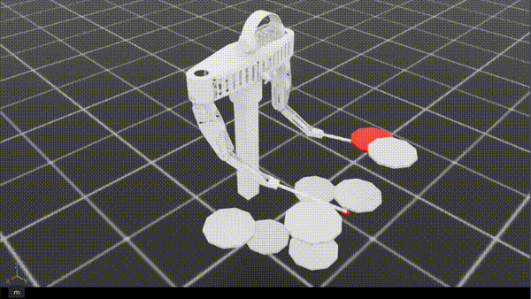

# Rhythmic Drum Striking

> **한 줄 요약**: `rdr`(04)의 보상·관측·행동 공간을 재설계하고, 학습 데이터를 MIDI 추출 악보에서 **랜덤 생성 RDS**로 전환하여 더 정제된 시간 정렬 타격을 학습시킨 실험. 절대 성공률은 여전히 낮지만 정책이 "치지 말자"에서 "치자, 하지만 부정확함"으로 이동.
>
> **Status**: 실패 (체크포인트 5M steps)
>
> **시기**: 2026-04 ~ 2026-05

---

## 1. 동기 (Why)

`rdr`(04)에서 1M step에도 success가 12%에 머문 원인을 회고에서 두 가지로 짚었다.

1. **phase 사이클 구조 폐기**: `ds`(03)에서 효과적이었던 lift/descend/return 패턴을 04에서는 proximity/progress의 fluid한 distance shaping으로 대체했는데, 이게 단발 타격 동작 학습에 오히려 손해였다는 진단.
2. **dense 신호의 부재**: `progress = 0.001`이라는 측정값이 보여줬듯, distance 기반 dense 신호가 실질적으로 작동하지 못함.

이 실험(`rrdr`)의 핵심 가설은:

> **04에서 폐기한 phase 보상을 RDS의 "다음 타겟"에 매번 적용하면 dense 신호가 회복될 것이다. 동시에 학습 분포를 단순화(랜덤 RDS)하면 정책이 우선 기본 패턴을 안정적으로 학습한 뒤 일반화로 나아갈 수 있다.**

추가로 `rdr`에서 보였던 부작용들(wrong hit penalty가 탐색을 막음, 정책이 드럼을 뚫고 들어가는 비현실적 동작 등)도 함께 잡고자 가중치와 페널티를 전반적으로 재조정했다.

---

## 2. 문제 정의 (What)

`rdr`과 동일: 5초 에피소드 동안 RDS의 각 노트에 대해 양손 중 하나가 ±10 step 윈도우 안에 그 드럼을 침. success/wrong/miss의 정의도 동일.

차이점은 RDS의 출처:

- **`rdr` (04)**: 실제 MIDI 파일에서 추출한 segment를 score 기반 sampling (`reset_target`)
- **`rrdr` (05)**: **`reset_target_rand`로 랜덤 생성된 RDS**. episode를 10개 구간으로 균등 분할하여 각 구간에서 (시점 1개, 드럼 1개)를 무작위로 선택. 즉 에피소드당 정확히 10개의 노트가 시간 간격을 두고 분산.

**중요한 학습 절차**: 처음부터 랜덤 RDS로 학습하면 수렴하지 못한다는 것을 확인. 그래서 **`rdr`(MIDI)로 100K step 학습한 체크포인트에서 시작**해 `rrdr`(랜덤 RDS)로 fine-tune. MIDI의 다양한 패턴에서 기본 운동을 익힌 후, 단순화된 랜덤 분포에서 안정적인 타이밍 정렬을 학습하는 2단계 curriculum.

---

## 3. 설계 (How)

### `rdr` 대비 변경점 한눈에

| 항목 | `rdr` (04) | `rrdr` (05) |
|---|---|---|
| RDS 소스 | MIDI 추출, score 기반 sampling | **랜덤 생성** (`reset_target_rand`) |
| 학습 시작 | scratch | **`rdr` 100K 체크포인트** |
| 관측 차원 | 288 | **304** (+16) |
| 새 관측 | — | **`hit_armed`** (2 hands × 8 drums = 16) |
| 행동 의미 | `target_q = robot_q + actions × 0.05` (위치 증분) | **`target_q = robot_q + (actions × π) × dt`** (속도 명령을 dt로 적분) |
| Phase 보상 | 없음 | **`strike_phase`, `rearm_phase`** (재도입) |
| Proximity | `curr_cost` 전체 | **`exp(-k·first_idx) × curr_cost`** (시간 감쇠) |
| `idle` | (x, y, z) 3차원 (tip 위치만) | **(x, y, z, waist θ)** 4차원 (자세까지) |
| `under_drum` 페널티 | 없음 | **있음** (드럼 표면 뚫고 내려가면 -) |
| 학습 step | 1M | 5M |

### 행동 공간의 의미 변화

`rdr`은 `actions × 0.05`가 한 step당 관절 각도 증분(위치)이었다. `rrdr`은 `actions × π`가 **관절 각속도 명령**(rad/s)이고, 환경이 `dt = 1/60s`만큼 적분해서 다음 위치를 만든다. 한 step당 최대 변화량(`π × 1/60 ≈ 0.052 rad`)은 비슷하지만, 의미는 다르다.

이렇게 바꾼 이유는 실제 드럼 로봇 하드웨어가 보통 속도 명령으로 제어되기 때문에 sim-to-real 시점에서 표현 일관성을 갖기 위함이고, RL 학습 측면에서는 정책이 "다음 자세"가 아닌 "지금 어느 방향으로 얼마나 빠르게"의 표현을 학습하게 된다.

### 관측의 변화

`rdr`의 288차원에 **`hit_armed` 16차원**이 추가되어 304차원. `hit_armed`는 (양손, 8드럼)의 boolean — 각 손이 각 드럼에 대해 지금 칠 수 있는 상태(armed)인지 disarmed인지를 직접 알려준다.

이 정보를 관측에 명시한 이유: 후술할 phase 보상이 `hit_armed`에 따라 다르게 활성화되는데, 정책이 이 상태를 알아야 일관된 행동을 학습할 수 있기 때문. 03(`ds`)에서 phase one-hot을 관측에 넣은 것과 동일한 원칙.

### Phase 보상의 재도입

`rdr`의 distance 기반 shaping(proximity/progress)에 더해, **`ds`(03)의 phase 보상이 RDS 컨텍스트에 맞게 부활**:

```
strike_phase = target × hit_armed × clamp(-vz)      # 다음 타겟 드럼에서, armed 상태일 때, 하향 속도를 보상
rearm_phase  = target × (¬hit_armed) × clamp(+vz)   # 같은 드럼에서, disarmed 상태일 때, 상향 속도를 보상
```

여기서 `target`은 미래 윈도우에서 가장 가까운 타겟 드럼의 mask. 즉 **다음 노트의 드럼을 향해**:
- 아직 안 친 상태(armed)면 → 내려치는 속도를 보상 (strike)
- 이미 친 상태(disarmed)면 → 다시 올라가는 속도를 보상 (rearm)

이건 `ds`의 LIFT/DESCEND/RETURN을 RDS의 매 노트마다 반복하는 셈이다. 환경이 명시적인 FSM 상태를 두진 않지만, `hit_armed` 1비트와 vz 부호의 조합으로 동일한 의미의 motion shaping을 만든다. 04 회고에서 "ds의 phase 패턴을 굳이 버리지 말았어야 했다"고 짚은 부분에 대한 직접적 응답이다.

가중치는 매우 작게 둠 (`w_strike_phase=0.1`, `w_rearm_phase=0.02`). dense 신호의 메인은 여전히 progress/proximity지만, phase가 motion의 방향성에 일관된 prior를 더한다.

### Proximity의 시간 감쇠

`rdr`은 `proximity = curr_cost`로 다음 타겟까지의 거리를 늘 동일 비중으로 페널티화. `rrdr`은:

```
proximity = exp(-k_idx × first_idx) × curr_cost  (k_idx = 0.1)
```

`first_idx`는 미래 윈도우에서 가장 가까운 타겟까지의 step 거리. 노트가 30 step 뒤에 있으면 `exp(-3) ≈ 0.05`로 거의 무시되고, 가까울수록(예: 5 step 뒤 → `exp(-0.5) ≈ 0.6`) 강하게 적용. **타이밍이 임박한 노트에 정책의 주의가 집중**되도록 유도.

### Under-drum 페널티

`rdr`에서 정책이 드럼 표면을 뚫고 아래로 내려가는 비현실적 자세를 학습할 수 있었음. `rrdr`은 **드럼 xy 범위 안에 있으면서 z가 표면보다 5cm 이상 낮으면** 페널티(`w_under_drum=0.02`)를 부여하여 이 함정 차단.

### `idle_pos`에 waist 각도 추가

`rdr`의 idle은 tip의 3D 위치(스네어 위 10cm). `rrdr`은 여기에 **waist joint의 idle 각도 10°를 추가**(4차원). `assignment_cost_for_targets`가 양손 tip 거리뿐 아니라 waist 자세까지 idle에 가까운지를 비용에 반영. 정책이 default 자세 prior를 유지하게 만들어, 양팔의 작업 공간이 일정한 reference frame에서 정의되도록 유도.

### 가중치 재조정

`rdr`의 가중치를 전반적으로 약화:

| 항 | `rdr` | `rrdr` | 변화 의미 |
|---|---|---|---|
| `w_success` | 1.0 | 0.5 | 상대적 비중 조정 |
| `w_wrong` | 1.0 | **0.15** | **탐색을 막던 큰 페널티를 대폭 약화** |
| `w_miss` | 1.0 | 0.2 | |
| `w_progress` | 50.0 | 10.0 | progress가 어차피 0에 가까우니 비중 축소 |
| `w_proximity` | 20.0 | 5.0 | 시간 감쇠 도입과 함께 작은 비중으로 |
| `w_tip_limit` | 2.0 | 0.1 | 큰 boolean 페널티 → 작은 soft 신호 |

**`w_wrong`을 1/7로 줄인 것**이 핵심. 04에서 wrong hit 페널티가 탐색 자체를 막아 정책이 "치지 말자"로 빠진다는 진단에 대한 직접적 반응.

### 환경 설정

| 항목 | 값 |
|---|---|
| 병렬 환경 | 128 |
| 에피소드 길이 | 5s |
| action_scale | **π** (속도 명령) |
| 랜덤 RDS 노트 수 | 10개 (균등 시간 구간에서 sampling) |
| 학습 step | 5M (100K MIDI pretraining 이후) |

---

## 4. 결과



보상 그래프 첨부 예정

```
reward=0.025 | proximity_term=0.006 | progress(x100)=0.310
strike_phase_term=0.352 | rearm_phase_term=0.068
action_l2=5.620 | joint_vel_l2=3.493 | limit_pen=0.000 | tip_limit_pen=0.000
under_drum_pen=0.537
success_rate=0.188 | wrong_rate=0.440 | miss_rate=0.372
snare_success_rate=0.152 | floor_success_rate=0.051 | mid_success_rate=0.136
high_success_rate=0.274 | hihat_success_rate=0.265 | ride_success_rate=0.222
crash1_success_rate=0.361 | crash2_success_rate=0.113

100K
reward=0.006 | proximity_term=0.005 | progress(x100)=0.143 | strike_phase_term=0.165 | rearm_phase_term=0.067 | action_l2=3.989 | joint_vel_l2=2.435 | limit_pen=0.000 | tip_limit_pen=0.000 | under_drum_pen=0.353 | success_rate=0.304 | wrong_rate=0.231 | miss_rate=0.465 | snare_success_rate=0.459 | floor_success_rate=0.291 | mid_success_rate=0.071 | high_success_rate=0.384 | hihat_success_rate=0.149 | ride_success_rate=0.089 | crash1_success_rate=0.117 | crash2_success_rate=0.017
```

`rdr`(04)과 비교한 질적 변화가 보인다:

| 메트릭 | `rdr` (04, 1M) | `rrdr` (05, 5M) | 변화 |
|---|---|---|---|
| reward | -0.265 | **+0.025** | 음수 → 양수 |
| success | 12% | **19%** | +60% 상대 |
| wrong | 24% | **44%** | +83% 상대 |
| miss | 64% | **37%** | -42% 상대 |
| progress | 0.001 | 0.310 (×100 후) | 의미 있는 양 |
| strike_phase | — | 0.352 | 새로 등장, 활성화 |

**정책의 모드가 바뀜**:

- 04: "치지 말자" — miss가 다수, wrong은 적게 시도. 보수적이고 정적.
- 05: "일단 치자" — miss가 줄고 wrong이 늘었으며 success도 함께 늘어남. 적극적이지만 부정확.

이 변화의 직접 원인은 **`w_wrong` 1/7 약화**(탐색 봉인 해제) + **phase 보상의 적극적 motion shaping** + **MIDI pretraining**(기본 운동 prior 확보)의 조합으로 해석된다. 메트릭 `strike_phase_term=0.352`는 정책이 "다음 드럼을 향해 내려치는 동작"을 실제로 만들어내고 있음을 보여준다.

**드럼별 양상의 흥미로운 변화**:

- 04는 idle 근처 드럼(hihat, floor, snare)이 가장 잘 됐다 → 가까운 데서만 머무는 경향
- 05는 오히려 **crash1(36%) / high(27%) / hihat(27%)**가 잘 되고 floor(5%)가 가장 안 됨 → 양팔이 어딘가로 움직여서 치긴 한다는 신호. 다만 floor가 가장 낮은 건 양손 분담이 여전히 불완전함을 시사 (오른손이 가는 위치가 floor)

`under_drum_pen=0.537`이 여전히 큼 — 드럼 표면을 일부 뚫고 들어가는 동작이 남아 있고, 페널티 가중치(0.02)가 약해서 학습 신호로 충분히 강하지 못함.

---

## 5. 무엇이 잘 됐는가

- **2단계 curriculum의 효과 확인**: 처음부터 랜덤 RDS로 학습하면 수렴하지 못함. MIDI 100K로 기본 운동 prior를 만든 후 단순화된 랜덤 분포로 옮기니 적어도 진전이 있는 정책이 만들어짐. **"분포가 단순한 task로 fine-tune"이 RL에서도 작동**한다는 경험적 확인.
- **Phase 보상의 재도입이 성과**: 04에서 0이었던 dense 신호(`progress`)가 다시 살아남(`strike_phase=0.352`). 03(`ds`)의 패턴이 RDS 컨텍스트에서도 유효함을 검증. `target × armed/disarmed × vz` 조합은 환경이 명시적 FSM 없이도 motion shaping을 만들 수 있는 가벼운 방법.
- **wrong penalty 약화의 효과 명확**: 정책이 탐색에서 풀려나오면서 success가 늘었고 보상도 양수로 전환.
- **속도 명령 표현**의 채택: sim-to-real 일관성 측면에서 의미 있는 결정. 학습 자체에도 큰 부정적 영향 없이 동작.
- **`hit_armed` 관측 노출** + phase 보상 페어링: 관측과 보상이 같은 상태 변수를 공유하여 정책이 일관된 행동을 학습할 수 있는 구조 확보.
- **`under_drum` / `idle_pos` 자세 prior** 같은 작은 prior들의 누적이 정책의 비현실적 동작을 줄이는 데 기여.

---

## 6. 한계와 막힌 점

진전이 있었지만 **여전히 실용 수준이 아님**.

- **success 19%는 너무 낮음**. 랜덤 RDS의 분포가 단순해졌음에도(노트 10개, 시간적으로 균등 분산) 5M step에서 80%의 노트는 여전히 정확히 처리되지 못함.
- **wrong rate 44%가 너무 높음**. 탐색은 풀렸지만 "치자"로 옮긴 정책이 정확도를 갖지 못함. 노트 시도의 거의 절반이 엉뚱한 타격. `w_wrong=0.15`가 약해서 정확성에 대한 압력 부족.
- **드럼별 편차의 비대칭**: floor 5%, crash2 11%로 특정 드럼이 극단적으로 안 됨. 양손 역할 분담이 정책 안에 명시적으로 prior로 들어가 있지 않아서, 어떤 드럼은 두 손 모두 가지 않거나 잘못된 손이 가는 듯한 양상.
- **`under_drum_pen=0.537`이 남아 있음**: 드럼을 뚫는 동작이 학습되어 있고, 가중치가 약해서 학습 신호로 충분히 강하지 못함. 시각적으로도 부자연스러운 사이클이 일부 남는다.
- **MIDI → 랜덤 RDS의 transfer가 의도대로 일반화되는지 불명확**: MIDI로 학습한 정책이 랜덤 RDS에서도 작동했지만, 거꾸로 랜덤 RDS로 학습한 정책이 MIDI에서 잘 작동할지는 검증되지 않음. 분포 일반화의 방향성이 한쪽으로만 검증된 상태.
- **dense 보상이 회복되긴 했지만 충분히 강하지 않음**: `progress(×100)=0.310`은 04 대비 큰 진전이지만, 가중치 10.0과 곱하면 step당 보상 기여가 여전히 모호. `strike_phase`가 더 큰 비중을 차지하는데, 가중치가 0.1로 작아서 메인 신호로 작동하기엔 약함.
- **속도 명령으로의 전환이 학습에 미친 정량적 효과**는 격리되지 않음. 여러 변경이 한꺼번에 들어가서 어떤 요소가 가장 큰 기여를 했는지 ablation 없음.

---

## 7. 다음 단계로 넘어간 이유

`rrdr`의 진전(보상 양수화, miss 절반 감소)에도 불구하고 **success 19%, wrong 44%는 실제 드럼 연주의 기준에는 한참 못 미친다**. 5M step을 더 돌렸을 때 가파른 개선은 예상하기 어려운 상태였다. 

핵심 미해결 과제:

1. **`under_drum_pen`이 여전히 큼** — 가중치 강화 또는 hit 판정 자체 재설계 필요.
2. **wrong rate 44%** — 정확성 압력을 어떻게 회복할지. `w_wrong`을 너무 키우면 04의 탐색 봉인 문제로 회귀.
3. **양손 분담의 학습 불완전** — 정책 구조나 보상 측면에서 양손을 다르게 다루는 메커니즘 필요.

다음 실험(06)에서 이 미해결 과제들을 어떻게 다룰지 결정.

---

## 8. 회고 / 배운 점

- **이전 실험의 회고가 다음 실험의 가설이 된다**: 04 회고에서 짚은 "ds의 phase 패턴 폐기 후회"가 05에서 phase 재도입으로 검증됐고, 실제로 dense 신호 회복에 기여. 회고를 진지하게 다음 실험 설계에 반영하는 사이클이 잘 작동.
- **curriculum의 위력, 그러나 의도된 curriculum**: 처음부터 랜덤 RDS면 수렴 못 함 → MIDI 100K로 운동 prior → 랜덤 RDS fine-tune. 단순한 분포로 옮기는 게 그 자체로 학습을 쉽게 만들지 않으며, **prior가 있는 상태**에서 단순 분포로 옮길 때 학습이 안정됨.
- **wrong penalty의 trade-off는 실재한다**: 04→05의 `w_wrong=1.0 → 0.15` 변화는 보수성을 풀어 시도를 늘렸지만 정확도는 떨어뜨렸다. 한 가중치가 정책의 모드를 통째로 바꿀 수 있다는 사실의 직접 체감.
- **phase 보상 = "타겟 × 상태 × motion"의 곱**이 매우 일반화된 패턴임을 확인. `ds`는 FSM phase × motion, `rrdr`은 RDS target × armed × vz. 외형이 다르지만 같은 인덱싱 트릭으로 같은 효과를 낸다.
- **관측과 보상은 같은 상태 변수를 공유해야 한다**: `hit_armed`를 보상에 썼다면 관측에도 줘야 정책이 일관된 행동을 학습한다. `ds`에서 처음 발견한 원칙이 여기서도 그대로 적용.
- **속도 명령 표현**: sim-to-real 일관성을 위한 표현 변경이 학습 자체에 큰 부정적 영향을 주지 않음을 확인. 다만 격리된 ablation이 없으므로 정량 효과는 미지수.
- **여러 변경을 한 번에 넣는 것의 한계**: 05는 RDS 소스, 행동 표현, phase 보상, proximity 감쇠, idle 자세, under_drum 페널티, 가중치 6개를 한꺼번에 바꿨다. 어떤 요소가 진전의 핵심이었는지 ablation 없이는 알 수 없음. 후속 실험에서는 변경을 더 격리해야 한다는 교훈.