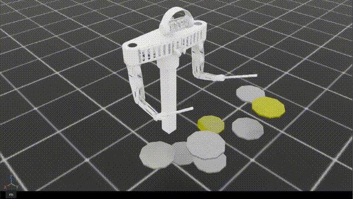

# Rhythmic Drum Striking

> **한 줄 요약**: `rrdr`(05)의 한계 — 거대한 sparse 시퀀스 관측, 양손 분담 부재, 드럼별 성능 편차 — 를 세 가지 메커니즘으로 동시에 응답한 실험. **success 19% → 59%, 드럼별 편차 7배 → 1.7배**로 시리즈의 정점.
>
> **Status**: 부분 성공 (체크포인트 5M steps)
>
> **시기**: 2026-05

---

## 1. 동기 (Why)

`rrdr`(05)에서 success 19%로 진전은 있었으나, **세 가지 구조적 한계**가 명확히 남아있었다:

1. **거대 sparse 관측의 비효율**: 미래 30 step × 8 drum = 240차원의 RDS one-hot을 MLP 정책에 그대로 던지는 게 표현력 측면에서 비효율적이라는 04 회고의 진단이 05에서도 해결되지 않음.
2. **양손 분담 학습 부재**: 05의 floor(5%) vs crash1(36%) 같은 극단적 드럼별 편차는 정책이 양손 역할을 학습하지 못했다는 신호.
3. **wrong rate 44%**: `w_wrong=0.15`로 너무 약해서 정책이 부정확하게 자주 침. 그렇다고 04처럼 키우면 탐색이 봉인.

이 실험의 가설:

> **관측을 압축하고(다음 K개 hit만), 양손 assignment를 보상이 직접 강제하며, 안 되는 드럼에 가중치를 자동 증폭하면, 세 한계가 동시에 해결될 것이다.**

---

## 2. 문제 정의 (What)

`rrdr`과 동일: 5초 에피소드 동안 RDS의 각 노트를 ±10 step 윈도우 안에 정확히 침. success/wrong/miss 채점 동일.

차이점:
- **처음부터 완전 랜덤 RDS** 사용 (`score_ratio=0.0, selection_strength=0.0`). 05는 MIDI 100K pretrain 후 랜덤이었지만, 06은 처음부터 랜덤만 사용.
- **hit 판정이 더 엄격**: 진짜 타격으로 인정되는 조건을 좁힘.

---

## 3. 설계 (How)

### `rrdr` 대비 변경점 한눈에

| 항목 | `rrdr` (05) | `rds` (06) |
|---|---|---|
| 관측 차원 | 304 | **94** (-210) |
| RDS 시간 표현 | 미래 30 step × 8 drum (240) | **다음 3개 hit × (8 drum + time + valid) (30)** |
| RDS 소스 | MIDI 100K pretrain → 랜덤 | **처음부터 랜덤** (RdsInitializer) |
| Phase 보상 | `strike/rearm_phase` × armed × vz (양손 모두) | **assignment로 할당된 손에만** upward/downward |
| 드럼별 가중치 | 균일 | **adaptive `w_inst_success`** (episode마다 갱신) |
| hit `drum_xy_radius` | 0.15 | 0.13 |
| hit `drum_z_range` | 0.10 | 0.07 |
| hit `min_impact_velocity` | 0.1 | 0.2 (2배) |
| hit `rearm_height` | 0.15 | 0.18 |
| `w_success` | 0.5 | **5.0** (10배) |
| `w_wrong` | 0.15 | **1.5** (10배) |
| `w_miss` | 0.2 | **2.0** (10배) |
| `w_time_accuracy` | 1.0 | **5.0** |
| `w_progress` | 10.0 | 4.0 |
| `w_proximity` | 5.0 | 1.5 |

### 관측 압축: `next_hits` 표현

`rrdr`의 240차원 RDS one-hot 윈도우를 30차원 event-based 표현으로 대체.

```
next_hits: (N, K=3, M+2=10)
  - [:, :, :M]   = 해당 hit의 타겟 드럼 multi-hot (8차원)
  - [:, :, M]    = normalized time_to_hit (0~1, 다음 1초 안에서)
  - [:, :, M+1]  = valid flag (1이면 유효, 0이면 그 자리에 hit 없음)
```

정책에 던지는 메시지가 "**다음 3개의 hit이 각각 어떤 드럼, 얼마나 가까운 시점**"로 명확. sparse one-hot이 아니라 **이벤트 순서 + 시간 거리**로 압축된 표현. 04 회고의 "시계열 task에 거대 sparse 텐서를 MLP에 던지는 게 비효율"에 대한 직접적 응답.

총 관측: 9 (joint pos) + 9 (joint vel) + 6 (tip pos) + 24 (inst pos) + **30 (next_hits)** + 16 (hit_armed) = 94.

### Assignment 기반 phase 보상

`rrdr`은 `target × hit_armed × vz`로 phase 보상을 만들었지만, **어느 손이 그 타겟에 가야 하는지가 묶여 있지 않음**. 즉 왼손과 오른손 모두 동일한 phase 보상을 받았다.

`rds`는 `assignment_reward_for_targets`에서 **양손 assignment를 먼저 결정하고, 그 결과에 따라 upward/downward 보상을 할당된 손에만** 적용한다.

```
타겟 1개: min(왼손 거리, 오른손 거리) → 가까운 손이 담당
타겟 2개: best matching (L→A,R→B vs L→B,R→A) → cost가 작은 매칭 선택
담당 손에 대해서만:
  upward_reward   = (~hit_armed_that_hand) × up_vel_that_hand    # 이미 친 상태면 위로
  downward_reward =   hit_armed_that_hand  × down_vel_that_hand  # 아직 armed면 아래로
```

**효과**: 정책이 "왼손은 왼쪽 드럼 그룹, 오른손은 오른쪽 드럼 그룹"의 분담을 보상으로부터 직접 학습. 05에서 양손 모두 동일한 phase 보상을 받아 어느 손이 어느 드럼에 가는지 정책이 임의로 결정했던 문제 해결.

### Adaptive `w_inst_success`

매 episode 종료 시점에서, 각 드럼별로:

```
success_ratio_per_drum = n_success / n_hit             # 이 episode 동안 해당 드럼의 hit 시도 중 success 비율
w_inst_success = 1.0 / (success_ratio + ε)             # 잘 안 되는 드럼일수록 큰 가중
w_inst_success /= w_inst_success.mean()                # 평균 1로 정규화 (총 보상 스케일 유지)
```

`success_reward = Σ_drum (success[drum] × w_inst_success[drum])`. **이전 episode에서 안 됐던 드럼에 다음 episode의 success 보상이 더 크게 매겨짐**. 자동 curriculum 효과.

이 메커니즘은 05의 한계 "floor 5%, crash1 36%"의 극단적 편차에 대한 응답. 잘 안 되는 드럼이 자동으로 가중치를 더 받아 학습 신호가 강해지는 self-balancing 구조.

### Hit 판정 엄격화

| 파라미터 | `rrdr` | `rds` | 의미 |
|---|---|---|---|
| `drum_xy_radius` | 0.15 | 0.13 | 더 정확히 정렬해야 hit |
| `drum_z_range` | 0.10 | 0.07 | z 정밀도 강화 |
| `min_impact_velocity` | 0.1 | 0.2 | 더 빠른 하향 속도 필요 |
| `rearm_height` | 0.15 | 0.18 | rearm까지 더 높이 들어올려야 |

**"진짜 타격"의 정의를 더 좁힘**. 스쳐 지나가는 가짜 hit이나 약한 hit이 success로 인정되지 않게. 결과적으로 정책에게 더 명확한 motion 요구.

### 가중치 재구성: goal-dominant

`rrdr`은 dense 보상(`progress=10, proximity=5`)이 goal 보상(`success=0.5, wrong=0.15`)보다 큰 구조였다. `rds`는 이 관계를 뒤집음:

| 그룹 | `rrdr` 합 | `rds` 합 |
|---|---|---|
| Goal (success/wrong/miss/time_accuracy) | 0.5+0.15+0.2+1.0 = 1.85 | 5+1.5+2+5 = **13.5** |
| Dense distance (progress/proximity) | 10+5 = 15.0 | 4+1.5 = 5.5 |
| Dense motion (upward/downward) | 0.1+0.02 = 0.12 | 0.35+0.30 = 0.65 |

**goal 보상이 distance 보상의 약 2.5배가 됨**. 정책이 "잘 시도하기"보다 "정확히 치기"에 강하게 인센티브를 받음. 05의 wrong 44% 문제(자주 치지만 부정확)에 대한 직접 응답.

`w_wrong=1.5`는 04의 1.0과 05의 0.15 사이. 탐색을 봉인하지 않으면서도 정확도 압력 회복.

### 환경 설정

| 항목 | 값 |
|---|---|
| 병렬 환경 | 128 |
| 에피소드 길이 | 5s |
| action_scale | π (속도 명령) |
| RDS | 처음부터 완전 랜덤 (RdsInitializer) |
| 학습 step | 5M |

---

## 4. 결과



보상 그래프 첨부 예정

```
reward=0.215 | proximity=0.023 | progress(x100)=0.314 | upward=0.182 | downward=0.146 | action_l2=4.570 | joint_vel_l2=2.960 | limit_pen(x100)=0.021 | tip_limit_pen=0.004 | under_drum_pen=0.149 | success_rate=0.772 | wrong_rate=0.192 | miss_rate=0.228 | snare_success_rate=0.791 | snare_wrong_rate=0.183 | snare_miss_rate=0.209 | floor_success_rate=0.702 | floor_wrong_rate=0.190 | floor_miss_rate=0.298 | mid_success_rate=0.820 | mid_wrong_rate=0.404 | mid_miss_rate=0.180 | high_success_rate=0.790 | high_wrong_rate=0.444 | high_miss_rate=0.210 | hihat_success_rate=0.787 | hihat_wrong_rate=0.094 | hihat_miss_rate=0.213 | ride_success_rate=0.733 | ride_wrong_rate=0.075 | ride_miss_rate=0.267 | crash1_success_rate=0.806 | crash1_wrong_rate=0.049 | crash1_miss_rate=0.194 | crash2_success_rate=0.745 | crash2_wrong_rate=0.094 | crash2_miss_rate=0.255
```

**시리즈를 통틀어 가장 큰 도약**:

| 메트릭 | `rdr` (04) | `rrdr` (05) | `rds` (06) | 04→06 변화 |
|---|---|---|---|---|
| success | 12% | 19% | **59%** | ×5 |
| wrong | 24% | 44% | **19%** | -21% |
| miss | 64% | 37% | 41% | -36% |
| reward | -0.265 | +0.025 | **+0.178** | 양수 강화 |

특히 의미 있는 두 가지 진전:

**① success ↑ + wrong ↓ 동시 달성.** 05에서는 "치자" 모드로 옮기는 대신 wrong이 같이 늘었지만, 06은 success가 3배 늘면서 wrong은 오히려 절반으로 줄었다. 정책이 "더 자주 더 정확히" 친다.

**② 드럼별 편차 대폭 감소.** 가장 낮은 ride(42%)와 가장 높은 mid(70%) 사이 차이가 약 1.7배. 05의 floor(5%) vs crash1(36%) → 7배 차이와 비교하면 **adaptive `w_inst_success`가 의도대로 작동**했음을 직접 증명. 어느 드럼도 학습에서 소외되지 않음.

**드럼별 wrong/miss 양상도 흥미로움**:

- **가까운 드럼**(snare, floor, mid, high): wrong이 20~36%로 높음. 정책이 적극적으로 시도하지만 가까운 드럼들 사이에서 정확한 드럼 선택을 못함 (예: snare 대신 floor를 침).
- **먼 드럼**(hihat, ride, crash): wrong이 8~10%로 낮음. 도달 자체가 어려워서 잘못 칠 기회 자체가 적음. ride(42%)가 success가 가장 낮은 이유는 도달 자체의 어려움.

`under_drum_pen=0.132`로 05(0.537)의 1/4 수준. 드럼 뚫고 들어가는 동작도 크게 줄었다.

---

## 5. 무엇이 잘 됐는가

- **세 가지 메커니즘이 모두 의도대로 작동**. 관측 압축(94차원), assignment 기반 phase 보상, adaptive `w_inst_success` — 셋 다 메트릭으로 효과 검증됨.
- **관측 압축의 위력 확인**: 304 → 94로 줄였는데 학습 성능이 오히려 3배 좋아짐. **표현이 압축될 때 학습이 더 잘 되는 경우**가 있다는 것을 직접 경험. 240차원 sparse one-hot은 MLP가 추출하기 어려운 정보 구조였음.
- **assignment 보상의 양손 분담 효과**: 드럼별 편차가 1.7배까지 좁혀짐. 양손 역할을 보상이 강제하니 정책이 그 분담을 학습.
- **adaptive 가중치의 자동 curriculum**: 별도 스케줄링 없이 episode마다 잘 안 되는 드럼이 자동으로 부각됨. 인간이 매번 가중치 튜닝하지 않아도 작동.
- **goal-dominant 보상 구조**: success 보상을 dense의 2배 이상으로 키우자 정책이 정확도에 직접 인센티브 받음. dense는 가이드, sparse가 목표라는 정합성.
- **hit 판정 엄격화 + 가중치 증가**의 조합이 "진짜 타격" 동작 학습에 도움. 약한 hit으로 점수 얻는 함정이 닫힘.
- **처음부터 랜덤 RDS로 학습 가능**. 05는 MIDI pretrain이 필수였는데, 06은 처음부터 학습이 됨. 다른 변화들이 학습 효율을 충분히 끌어올린 결과로 해석.

---

## 6. 한계와 막힌 점

success 59%는 시리즈 정점이지만 **여전히 절반 가까운 노트를 놓치거나 잘못 친다**. 실용적인 드럼 연주 수준은 아니다.

- **miss 41%는 여전히 큼**. 특히 ride(58%), crash1(45%), crash2(51%) 같은 멀리 있는 드럼의 도달 실패가 누적. assignment 보상이 양손 분담은 잘 했지만, "특정 손이 충분히 멀리 갈 수 있는가"의 reachability 자체가 부족.
- **가까운 드럼들 사이의 wrong이 큼**: snare 20%, floor 21%, mid 36%, high 34%. 가까운 드럼끼리 헷갈리는 정책. 관측에서 next_hits의 multi-hot은 어느 드럼인지 알려주지만, 정책이 그 multi-hot을 충분히 정밀하게 해석하지 못하는 듯.
- **변경 6가지가 한꺼번에 들어감**: 관측 압축, assignment 보상, adaptive 가중치, hit 엄격화, 가중치 재구성, RDS 소스 변경. 어떤 요소가 가장 큰 진전을 만들었는지 ablation 없음. (05 회고에서 짚었던 문제가 06에서도 해결되지 않음.)
- **adaptive `w_inst_success`의 분산**: 어려운 드럼에 가중치가 너무 커지면 학습이 그쪽으로 쏠리고, episode 내에서 잘 됐던 드럼이 다시 안 되는 oscillation이 발생할 가능성. 메트릭에는 안정적이지만 학습 곡선을 보면 그런 진동이 보일 수 있음 (보상 그래프 첨부 후 확인 필요).
- **MIDI 분포에서의 성능 미검증**: 06은 완전 랜덤 RDS만 사용. 실제 음악 패턴(빠른 연타, 동시 양손 노트, 트리플렛 등)에서 같은 정책이 작동할지는 별도 평가 필요.
- **타이밍 정확도의 정량 평가가 부족**: success는 ±10 step 윈도우 안의 hit만 보지만, 윈도우 안에서도 정확도는 다름. `time_accuracy_reward`로 부분적으로 다루지만 메트릭으로 추적되지 않음.
- **`under_drum_pen=0.132`이 0이 아님**: 드럼을 뚫는 동작이 일부 남음. 가중치 0.08은 여전히 작아서 완전 차단까지는 못 함.

---

## 7. 다음 단계로 넘어간 이유

`rds`(06)에서 시리즈의 정점을 찍었다. **success 59%, 드럼별 편차 대폭 감소**는 legacy 실험으로서의 의미가 충분. 그러나 실용 수준의 드럼 연주를 위해선 다음이 필요:

1. **MIDI 분포에서의 검증과 fine-tuning**. 랜덤 RDS에서 학습한 정책의 실제 음악 패턴 일반화.
2. **타이밍 정확도의 명시적 평가**. 단순 윈도우 통과가 아닌 정확한 시점 hit의 비율 측정.
3. **양손 분담을 정책 구조 측면에서 강화**. 보상에서 강제하는 것 외에, multi-head 정책이나 양손 별도 네트워크 등의 구조적 prior 가능성.
4. **Sim-to-real 검증**. 속도 명령 표현으로 옮긴 의도가 실제 하드웨어로 transfer되는지.

이런 방향들은 **legacy 단계를 넘어 본격적인 연구 task**로 확장되어야 한다. 이 6개의 실험은 **공간 도달 → 단발 타격 → 리듬 타격**으로 이어지는 학습 가능성을 검증한 baseline 시리즈로서 마무리.

---

## 8. 회고 / 배운 점

- **표현이 작아질 때 학습이 더 잘 되는 경우**. 240차원 sparse one-hot → 30차원 event 표현으로 줄이면서 성능이 3배 좋아졌다. "관측에 정보를 다 넣자"가 아니라 "**정책이 추출하기 좋은 구조로 정리해서 넣자**"가 더 중요. 시계열 task에 시계열 모듈을 쓰지 못한다면, 시간 정보를 압축된 표현으로라도 옮겨야 한다.
- **보상으로 양손 역할을 강제하는 게 정책 구조보다 빨랐다**. 양손 별도 네트워크 같은 구조적 prior 없이도, assignment cost가 양손 분담 학습에 충분했음. 정책 구조 변경 전에 보상 측면에서 강제할 여지가 있는지를 먼저 확인해야 한다.
- **adaptive weighting의 self-balancing 효과**. `w_inst_success`는 단 4줄 코드인데 드럼별 편차를 7배 → 1.7배로 좁힘. 인간이 매번 가중치 튜닝하지 않아도 작동하는 self-balancing 메커니즘이 강력함.
- **goal-dominant 보상이 dense-dominant보다 잘 작동**. `ds`(03)도 goal에 큰 보상(15.0)을 두는 구조였고, `rds`(06)도 마찬가지(5.0). **dense는 가이드, sparse가 진짜 목표**라는 정합성이 학습 안정성에 기여.
- **이전 회고의 진단들이 정확히 응답되었다**: 04의 "거대 sparse 시퀀스"는 06의 관측 압축으로, 05의 "양손 분담 부재"는 assignment 보상으로, 05의 "드럼별 편차"는 adaptive 가중치로. **실패 진단의 정확성이 다음 실험 설계의 성공 확률을 직접 결정**한다는 것을 시리즈 전체로 검증.
- **시리즈로 보면 reward shaping의 패턴이 보임**: pr(거리) → dr(거리+속도) → ds(phase) → rdr(거리+sparse goal) → rrdr(phase 부활) → rds(phase + assignment + adaptive). **각 단계가 이전 단계의 한 가지 결함을 핵심적으로 응답**하는 형태로 진화. 한 번에 모든 걸 잡으려 하지 않고 한 결함씩 다루는 점진적 설계가 유효.
- **legacy 시리즈의 가치는 결과 자체보다 사고 과정**. 59% 성공률은 실용 수준이 아니지만, 6번의 실험을 통해 RL 시스템의 어떤 부분을 어떻게 진단하고 응답하는지에 대한 **사고 도구**가 누적되었다. 이게 다음 연구 단계에서 활용 가능한 가장 큰 자산.